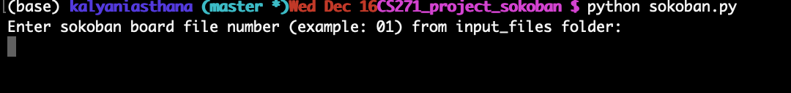
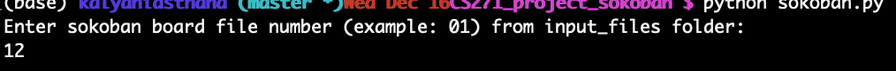
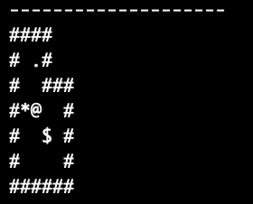
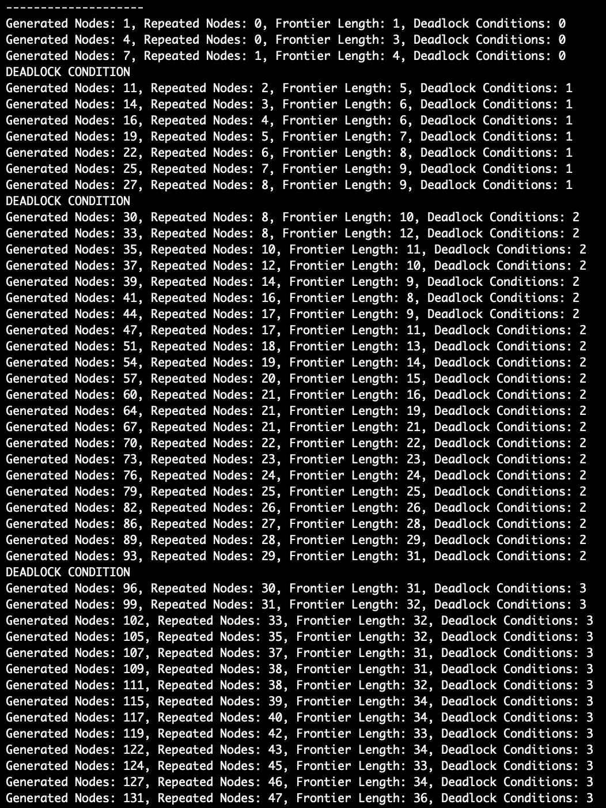
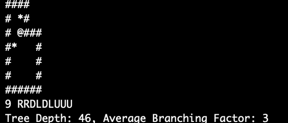

# Sokoban Solver using A* Search
Sokoban is a game played on a board of squares, where each square/coordinate of the board can be either a wall, a box, a player, a storage location or just the empty floor. The player is allowed to move vertically or horizontally to empty floor squares and storage locations only. The player can move to these locations either while pushing a box or without pushing a box. The goal of the player in this game is to move all boxes to storage locations. For more details on this game or our solver, check out our project report document.

## Build Instructions

This game is written in `Python` (specifically version 3.7.6 but works with any Python3 version). It doesn't require any fancy modules apart from some which come preinstalled with Python namely `math, time and os`. 

To run it, navigate to the Solver's folder on the terminal and type `python sokoban.py`. Doing this will show you prompt which will ask you the enter the file number (from the input_files folder) of the board which you want to solve. For example, to solve the board sokoban00.txt, enter 00 to the prompt.  
\
The Solver will try to solve the game and return a sequence of the form `n UUDDRRLL...` if such a solution is found, and `SOLUTION NOT FOUND` otherwise.

## Screenshots 

* This is the prompt you should get when you run `python sokoban.py` \

* Suppose we want to solve the board input12.txt. To do this, we enter 12 to the prompt \

* The Solver prints out the initial board representation \

* The Solver then proceeds to solve the board and prints out some performance metrics \

* Prints out the final board if a solution is found \

## Want to test your own input ? 

* Make sure that you place your board configuration file (representation of the board that looks like input00.txt or something similar) in the `input_files` folder
* Type `python sokoban_input_converter.py`
* You will see a prompt asking you to enter the file number which you want to convert. For example, to covert input00.txt to sokoban00.txt, enter 00 to the prompt.  
* sokoban_input_converter will convert the board from an inputXY.txt format to sokobanXY.txt. The latter format can be used as an input to `sokoban.py`.

## Motivation

Nowadays, Artificial Intelligence (AI) is a hot topic and also one of the fields whose advances will determine our future. Generating robust algorithms in AI, especially for complex problems is essential. It's even better to test these robust algorithms on setups that are easy to explain and comprehend in terms of space and time complexity. One of such easy setups is the game of Sokoban and one of the several robust AI algorithms is A* search. We have build a Sokoban Solver using A* Search to apply our theoretical understanding of AI algorithms on a somewhat easy game as a part of our course project Introduction to Artificial Intelligence (CS273A) at the University of California, Irvine.

## Contribute

This is still not a perfect Sokoban Solver and either fails to solve or takes too much time on many of the inputs under the `input_files` folder. We would really appreciate if you contribute to this Solver and help us optimize it further! Just create a regular pull request to contribute :smiley: (Think of a new Heuristic? a new kind of deadlock?)

## License

MIT © Kalyani Asthana, Hamza Errahmouni Barkam, Jason (Zesheng) Chen 2020. 
